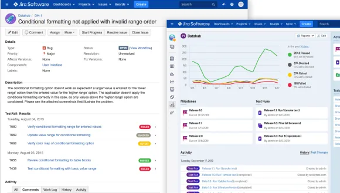

There are tons of important factors that can have a significant impact on the effectiveness and efficiency of a testing process for a modern software organization. Still, nothing can get in the way more than a terrible test case management tool.

<!--truncate-->

This article was originally published on medium: [Test Case Management Should Not Be This Difficult](https://dsayling.medium.com/test-case-management-should-not-be-this-difficult-3015286ea4f1)

As a huge believer of continuous testing and DevOps release principles, using a test case management solution is more of a hindrance than a help to improving lead-time, process-time, and %C/A. Assuming you have a robust pipeline, with individual product development pipelines aligned to business value streams (with loosely couple products) and tests blocking your release, you don't need complex test reports or complicated requirements tracking (pssst, it should just be built into the pipeline).

That said, some organizations still want external test case management tools for either manual QEs, management, or auditing. I would argue that using a test case management tool for these stakeholders won't give them the "quality" improvements and tracking they want. These are all personal opinions based on my experience with various test case management tools.

## Shopping Around
When shopping for the best test case management tool for you, you will usually focus on the following:

**Cost**: Is the tool within your budget? (Don't overpay for a solution and check for hidden costs, e.g., storage allowance, person-hours for workflow integration and training, long term maintenance)

**Ease of use**: Is the tool easy to learn and use? (I've learned this varies widely person-to-person and their understanding of test case organization best practices)

**Compatibility**: Does the tool integrate with your current workflow and tools? (e.g., project management software, bug tracking software, version control system)

**Features**: Does the tool have the features you need? (e.g., support for multiple projects, test case organization and categorization, API access, test execution, and reporting)

**Customizability**: Can you customize the tool to meet your specific needs? (e.g., custom fields, custom reports, custom environments)

**Support**: Does the tool come with good documentation and customer support? (This is extremely important — remember quantity does not equal quality. [Verify the documentation matches the implementation.](https://gist.github.com/dsayling/43427114fcea9809fb07846c30293366))

Some popular test case management tools include:

- [TestRail](https://www.gurock.com/testrail/) (the current tool I work with)
- [Zephyr](https://smartbear.com/test-management/zephyr/) (evaluated at a previous organization, and possibly an exception to this article since it takes the full capability of JIRA)
- [TestLink](https://www.testlink.org/) (open-source and never used)
- [qTest](https://www.tricentis.com/products/unified-test-management-qtest/test-case-manager) (used at a previous organization for four years)
- ALM/QC (formerly HP ALM/QC, THE waterfall project and quality tool for dinosaurs)
- This list could go on for a while

## The Problems

### Terrible automated test integration

Poor integration with automated testing tools can make it difficult to track the results of tests and can also make it challenging to keep your test cases up-to-date as your code evolves.

Some solutions offer automated results upload to their system via a JUnit XML report, but they break down when simply managing the test cases. Keeping the test cases in sync via these systems usually entails a process fraught with lead-time-heavy steps that can grow exponentially.

Take a quick look at TestRail's current implementation, the [TestRail CLI](https://github.com/gurock/trcli).

Test Cases are added based on an "automation ID." This automation ID is simply some combination of the module or classname and the test function — depending on your software language. This ID must be added as a custom field to test cases via the API or the user interface. I have to choose what project to enable this field on or globally enable it to all test cases via the TestRail UI. Then, I have to make sure the default template for the project uses this field as well. What happens if I move or rename anything? I've lost the history and ended up with a new test case — brilliant.

What about requirements, er, I mean, "Reference" tracking? A user has to do the legwork to ensure the appropriate fields are set on the --case-fields flag every time. However, this flag assumes every test case created in the run contained in the JUnit XML report has the identical list of requirements tested. Frankly, I doubt that's the case.

### Suboptimal requirements tracking
If a test case management tool doesn't provide effective means to track requirements, it can be challenging to ensure that your testing is comprehensive.

The goal is simple, right? I get a requirement, write a test for it, run the test, and mark the requirement as covered for some cycle, release, milestone, etc. If only the tools had made it that simple.

qTest, for example, forced your origin of requirements to be qTest, not JIRA, where your product team is probably writing them in the first place. qTest contends with their own requirements in their tool, at least when I used it circa 2017, with really poor JIRA integration. qTest integrated with JIRA by simply adding a field into JIRA with the requirement from qTest, not the other way around.

TestRail goes off the rails even further. They offer, what they call, a Jira integration to show your results and test cases that map to the issue you're viewing in JIRA. It looks pretty, but there's something you probably wouldn't guess looking here.

You can't build a JQL report using IDs from TestRail. The simple reason why is that TestRail doesn't update the JIRA database. The results and cases that appear on the issue are just iframes where the JIRA ID is part of the request for the iframe. This lack of proper integration makes querying for coverage across multiple JIRA issues impossible with JQL.

### Poor test case organization
If a test case management tool doesn't provide a flexible and intuitive way to organize your test cases, it can be challenging to keep track of your testing progress, and you may miss essential tests or waste time trying to find the proper tests to run.

I see this all the time. Every individual has their own way of doing things, and so does every test case management tool such as Projects, Test Suites, Test Groups, etc. These test case categorizations typically map to some test result categorization like Plans, Runs, Cycles, Milestones, etc.

If the practices in the QA organization are not well flushed out and you don't have agreed-upon usages of these categories, [you're gonna have a bad time](https://www.youtube.com/watch?v=6Ls5j5iz2eA). If you're not careful, you'll likely end up with manual QEs copying test cases and duplicating things when it’s unnecessary. If you're also trying to maintain manual tests and automated tests together, this makes finding overlap or existing tests difficult to find.

I like to keep things DRY in my testing. Reuse what's possible, and keep the organization to enable easy test case discovery. For example, with TestRail, in multi-suite mode, there's no easy way to create a plan with multiple suits and filtering for all test cases. Each suite must be added manually, so users trying to build a test plan to ensure proper references need to know what suites contain relevant test cases. The API does make it slightly easier to do this programmatically)With TestRail, I recommend always using single suite mode, even with many test cases, as it enables wholesale filtering on every test case within a project.

### Annoying test result metadata

Metadata such as test status, priority, and owner can be critical for effective test management, and most tools support these. However, what happens when you need additional environment details or test configuration details?

Setting up custom result metadata in most tools is not trivial and often requires an administrator to update any enumerated values or add any additional field. Also, I'm typically limited to simple string values — which can make storing complex structured data you already have difficult.

### No database access and bad reports

A test case management tool must provide direct access to its underlying database to create custom reports usable for stakeholders. This is usually possible when using a self-hosted solution, but it’s not guaranteed, so confirm with the sales rep that direct database access is possible. However, no database access is typical with a cloud-based solution.

Most tools, whether self-hosted or cloud-based, provide some report interface to give you graphs and tables of report data. However, these tools are typically limited to their metadata values, making reporting off your custom values difficult. They are also limited in how you can build a query, usually limiting you to a specific set of templates in which you can choose what values to filter, sort, and categorize. In TestRail, I’m also limited to a single project, so if I want any cross-project report, I have to do so outside the user interface.

For the third time, I'm currently building a custom database solution to add automated test results and exporting manual runs to a database for visualization in some corporate tool. In this case, Tableau. \*\*shakes fist\*\*

## Now what?
These issues demonstrate the importance of carefully evaluating test case management tools before committing to one. Finding a tool that meets your specific needs and provides the best support for your testing process is crucial. If the practices and processes in the QA organization are not well flushed out and you don’t have agreed-upon usage and understanding of the test tool, you’re gonna to have a bad time. If you have found a tool you like, please share your positive experiences with others in the comments to help them find a tool that works for them.