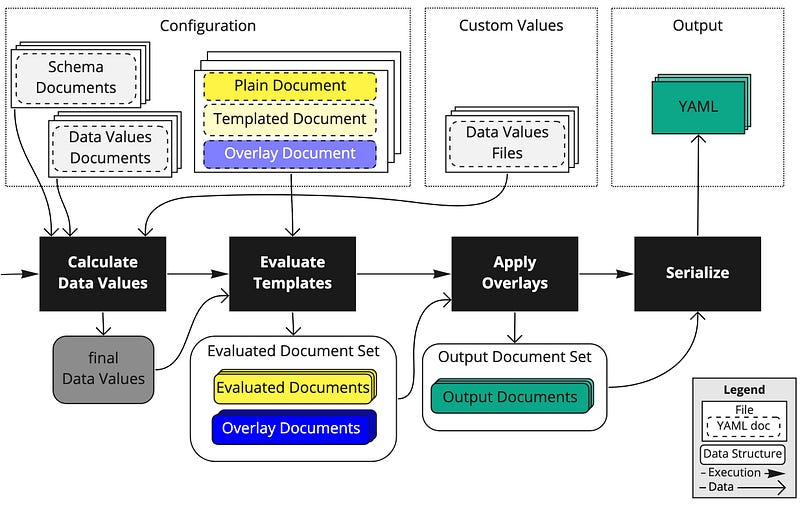

When I first learned about yet I thought to myself, why on earth would you want to do something like add code-like comments to some YAML file, process it with some other YAML files, just to create a NEW YAML file? Well, the answer only became obvious when I began managing a software project that processed a lot of YAML. Just how much YAML? We'll get to that in a minute. But first…

<!--truncate -->



## Background

About 3 years ago, not too long after joining my previous company I stumbled across a yaml file checked into a microservice repository that had a syntax I'd never seen.

```yaml
@ load("@ytt:data", "data")
```

I was slightly mortified after dealing with jinja and wanting templating to be gone from my life, but I began reading none the less.


### What is ytt?

>[ytt](https://carvel.dev/ytt/) is a command-line tool used to template and patch YAML files. It also provides the means to collect fragments and piles of YAML into modular chunks for easy re-use.

I mean that seems pretty straightforward. The goal of ytt is to provide a way to maintain a bunch of YAML files without it becoming too cumbersome. So that could mean, kubernetes manifests, helm charts, or even just a bunch of configuration files.

## Why am I writing this?

Initially, I tossed it off as some sort of solution to a non existent problem, but these tools dont get built because problems dont exist. 3 years later I am beginning to face my own yaml problem that I think ytt could solve.

So how much YAML does my team's tool process? Here's a preview

```
────────────────────────────────────────────────────────────────────
Language                 Files     Lines   Blanks  Comments     Code
────────────────────────────────────────────────────────────────────
YAML                      1245    552086     4400     16447   531239
```

😅

I've also realized while ytt has some great documentation, some simple playbook is hard to come by.

So let's get started.

Go see how to use [ytt in my tutorial section](../../docs/ytt/)

